# CalculateEnhanced Service

## Overview
An enhanced calculator service that performs basic arithmetic operations (add, subtract, multiply, divide) on two numbers with support for decimal numbers, automatic rounding to 4 decimal places, comprehensive error handling, debug logging, and **automatic event publishing to Kafka** for each successful calculation.

**New Feature:** This service now publishes calculation events to a Kafka topic (`calculator.events`) using a "fire and forget" pattern. Event publishing failures are handled silently and do not affect the calculation result.

## Flow Diagram

```mermaid
graph TD
    Start{{Start}} --> Input[/Inputs:<br/>number1, number2, operation/]
    Input --> InitMap["MAP<br/>━━━━━━━━━━━━<br/>set result = 'NaN'<br/>set success = 'false'<br/>set errorMessage = ''"]
    InitMap --> DebugInput[[INVOKE pub.flow:debugLog<br/>Log input parameters]]
    DebugInput --> Try{TRY Block}
    
    Try --> Switch{SWITCH<br/>operation}
    
    Switch -->|add| DebugAdd[[INVOKE pub.flow:debugLog<br/>Log addition]]
    Switch -->|subtract| DebugSub[[INVOKE pub.flow:debugLog<br/>Log subtraction]]
    Switch -->|multiply| DebugMul[[INVOKE pub.flow:debugLog<br/>Log multiplication]]
    Switch -->|divide| DebugDiv[[INVOKE pub.flow:debugLog<br/>Log division]]
    Switch -->|default| ErrorMap["MAP<br/>━━━━━━━━━━━━<br/>set errorMessage = 'Unknown operation'"]
    
    DebugAdd --> AddInvoke[[INVOKE pub.math:addFloats]]
    DebugSub --> SubInvoke[[INVOKE pub.math:subtractFloats]]
    DebugMul --> MulInvoke[[INVOKE pub.math:multiplyFloats]]
    DebugDiv --> DivInvoke[[INVOKE pub.math:divideFloats]]
    
    AddInvoke --> Round[[INVOKE pub.math:roundTo<br/>Round to 4 decimals]]
    SubInvoke --> Round
    MulInvoke --> Round
    DivInvoke --> Round
    
    Round --> DebugRound[[INVOKE pub.flow:debugLog<br/>Log rounded result]]
    DebugRound --> SuccessMap["MAP<br/>━━━━━━━━━━━━<br/>set success = 'true'<br/>set errorMessage = ''"]
    SuccessMap --> DebugSuccess[[INVOKE pub.flow:debugLog<br/>Log success]]
    DebugSuccess --> EventTry{TRY<br/>Event Publishing}
    
    EventTry --> BuildEvent["MAP<br/>━━━━━━━━━━━━<br/>Build event JSON"]
    BuildEvent --> SendEvent[[INVOKE SendEvent<br/>Publish to Kafka]]
    SendEvent --> EventSuccess[[INVOKE pub.flow:debugLog<br/>Event published]]
    EventSuccess --> EventCleanup["MAP<br/>━━━━━━━━━━━━<br/>drop event vars"]
    
    EventTry -->|Error| EventCatch[CATCH<br/>Silent Error]
    EventCatch --> EventError[[INVOKE pub.flow:debugLog<br/>Event failed - continue]]
    EventError --> EventErrorCleanup["MAP<br/>━━━━━━━━━━━━<br/>drop event vars"]
    
    EventCleanup --> CleanupSuccess["MAP<br/>━━━━━━━━━━━━<br/>drop intermediate vars"]
    EventErrorCleanup --> CleanupSuccess
    
    ErrorMap --> DebugError[[INVOKE pub.flow:debugLog<br/>Log unknown operation]]
    DebugError --> Exit[EXIT<br/>FAILURE]
    Exit --> Catch
    
    Try -->|Error| Catch[CATCH Block]
    Catch --> GetError[[INVOKE pub.flow:getLastError]]
    GetError --> ErrorHandleMap["MAP<br/>━━━━━━━━━━━━<br/>set success = 'false'<br/>set result = 'NaN'<br/>set errorMessage from lastError"]
    ErrorHandleMap --> DebugCatch[[INVOKE pub.flow:debugLog<br/>Log error]]
    DebugCatch --> CleanupError["MAP<br/>━━━━━━━━━━━━<br/>drop error vars"]
    
    CleanupSuccess --> FinalCleanup["MAP<br/>━━━━━━━━━━━━<br/>drop number1<br/>drop number2<br/>drop operation"]
    CleanupError --> FinalCleanup
    
    FinalCleanup --> Output[\Outputs:<br/>result, success, errorMessage\]
    Output --> End[End]
    
    style Start fill:#00FF00,color:#000
    style End fill:#FF0000,color:#FFF
    style AddInvoke fill:#87CEEB,color:#000
    style SubInvoke fill:#87CEEB,color:#000
    style MulInvoke fill:#87CEEB,color:#000
    style DivInvoke fill:#87CEEB,color:#000
    style Round fill:#87CEEB,color:#000
    style GetError fill:#87CEEB,color:#000
    style DebugInput fill:#87CEEB,color:#000
    style DebugAdd fill:#87CEEB,color:#000
    style DebugSub fill:#87CEEB,color:#000
    style DebugMul fill:#87CEEB,color:#000
    style DebugDiv fill:#87CEEB,color:#000
    style DebugRound fill:#87CEEB,color:#000
    style DebugSuccess fill:#87CEEB,color:#000
    style DebugError fill:#87CEEB,color:#000
    style DebugCatch fill:#87CEEB,color:#000
    style SendEvent fill:#87CEEB,color:#000
    style EventSuccess fill:#87CEEB,color:#000
    style EventError fill:#87CEEB,color:#000
    style Try fill:#FFD700,color:#000
    style Catch fill:#FFA500,color:#000
    style EventTry fill:#FFD700,color:#000
    style EventCatch fill:#FFA500,color:#000
    style Switch fill:#FFD700,color:#000
    style InitMap fill:#E6E6FA,color:#000
    style ErrorMap fill:#E6E6FA,color:#000
    style SuccessMap fill:#E6E6FA,color:#000
    style ErrorHandleMap fill:#E6E6FA,color:#000
    style CleanupSuccess fill:#E6E6FA,color:#000
    style CleanupError fill:#E6E6FA,color:#000
    style FinalCleanup fill:#E6E6FA,color:#000
    style BuildEvent fill:#E6E6FA,color:#000
    style EventCleanup fill:#E6E6FA,color:#000
    style EventErrorCleanup fill:#E6E6FA,color:#000
```



## Service Details

**Namespace:** `WxVibeCodingDemos.project1.calculator`  
**Service Name:** `CalculateEnhanced`  
**Full Service Path:** `WxVibeCodingDemos.project1.calculator:CalculateEnhanced`

## Input Parameters

| Parameter | Type | Required | Description |
|-----------|------|----------|-------------|
| number1 | String | Yes | First number for the calculation (supports decimals) |
| number2 | String | Yes | Second number for the calculation (supports decimals) |
| operation | String | Yes | Operation to perform: `add`, `subtract`, `multiply`, or `divide` |

## Output Parameters

| Parameter | Type | Description |
|-----------|------|-------------|
| result | String | The result of the calculation rounded to 4 decimal places, or "NaN" if error occurred |
| success | String | "true" if calculation succeeded, "false" if error occurred |
| errorMessage | String | Empty string if successful, error description if failed |

## Key Features

### 1. Decimal Number Support
- Uses `pub.math:addFloats`, `subtractFloats`, `multiplyFloats`, `divideFloats` for decimal support
- Handles both integer and decimal inputs seamlessly

### 2. Automatic Rounding
- All results are rounded to 4 decimal places using `pub.math:roundTo`
- Ensures consistent precision across all operations

### 3. Comprehensive Error Handling
- TRY/CATCH blocks surround all operations
- Uses `pub.flow:getLastError` to capture dynamic error messages
- Consistent output structure regardless of success or failure

### 4. Debug Logging
- Logs input parameters at service start
- Logs each operation type before execution
- Logs raw and rounded results
- Logs success or error messages
- All debug logs use variable substitution for actual values

### 5. Event Publishing (Fire and Forget)
- **Automatic Kafka Integration**: Publishes calculation events to `calculator.events` topic after each successful calculation
- **Silent Error Handling**: Event publishing failures do not affect the calculation result
- **Event Data**: Includes operation type, input numbers, and result in JSON format
- **Mock Implementation**: Currently uses a mock Kafka service that logs events (can be replaced with actual Kafka adapter)
- **Service Used**: `WxVibeCodingDemos.project1.eventing:SendEvent`

**Event JSON Structure:**
```json
{
  "operation": "add",
  "number1": "10.5",
  "number2": "5.25",
  "result": "15.75"
}
```

### 6. Consistent Output
- Always returns the same three output fields: `result`, `success`, `errorMessage`
- On error: `result = "NaN"`, `success = "false"`, `errorMessage = <error details>`
- On success: `result = <calculated value>`, `success = "true"`, `errorMessage = ""`

## Supported Operations

- **add** - Adds number1 and number2
- **subtract** - Subtracts number2 from number1
- **multiply** - Multiplies number1 and number2
- **divide** - Divides number1 by number2
- **default** - Returns error for any other value

## Usage Examples

### Example 1: Addition with Decimals
**Input:**
```json
{
  "number1": "10.5",
  "number2": "5.25",
  "operation": "add"
}
```

**Output:**
```json
{
  "result": "15.75",
  "success": "true",
  "errorMessage": ""
}
```

### Example 2: Division with Rounding
**Input:**
```json
{
  "number1": "10",
  "number2": "3",
  "operation": "divide"
}
```

**Output:**
```json
{
  "result": "3.3333",
  "success": "true",
  "errorMessage": ""
}
```

### Example 3: Multiplication with Large Decimals
**Input:**
```json
{
  "number1": "3.14159",
  "number2": "2.71828",
  "operation": "multiply"
}
```

**Output:**
```json
{
  "result": "8.5397",
  "success": "true",
  "errorMessage": ""
}
```

### Example 4: Division by Zero (Error Case)
**Input:**
```json
{
  "number1": "10",
  "number2": "0",
  "operation": "divide"
}
```

**Output:**
```json
{
  "result": "NaN",
  "success": "false",
  "errorMessage": "/ by zero"
}
```

### Example 5: Unknown Operation (Error Case)
**Input:**
```json
{
  "number1": "10",
  "number2": "5",
  "operation": "power"
}
```

**Output:**
```json
{
  "result": "NaN",
  "success": "false",
  "errorMessage": "Unknown operation: power"
}
```

### Example 6: Invalid Number Format (Error Case)
**Input:**
```json
{
  "number1": "abc",
  "number2": "5",
  "operation": "add"
}
```

**Output:**
```json
{
  "result": "NaN",
  "success": "false",
  "errorMessage": "For input string: \"abc\""
}
```

## HTTP Invocation

To invoke this service via HTTP:

```bash
curl -X POST "http://localhost:5555/invoke/WxVibeCodingDemos.project1.calculator/CalculateEnhanced" \
  -H "Content-Type: application/json" \
  -u "Administrator:manage" \
  -d '{
    "number1": "10.5",
    "number2": "5.25",
    "operation": "add"
  }'
```

## Implementation Details

1. **Initialization**: Sets default output values (`result = "NaN"`, `success = "false"`, `errorMessage = ""`)
2. **Input Logging**: Logs all input parameters with variable substitution
3. **Operation Selection**: Uses SWITCH statement to route to appropriate math service
4. **Operation Logging**: Logs the operation type before execution
5. **Calculation**: Invokes appropriate float-based math service
6. **Rounding**: Rounds result to 4 decimal places using `pub.math:roundTo`
7. **Result Logging**: Logs both raw and rounded results
8. **Success Handling**: Sets success flag and logs successful calculation
9. **Event Publishing** (Fire and Forget):
   - Builds JSON event data with operation details and result
   - Invokes `WxVibeCodingDemos.project1.eventing:SendEvent` to publish to Kafka
   - Wrapped in TRY/CATCH to handle errors silently
   - Event publishing failures are logged but do not affect calculation result
   - Drops event-related variables after publishing
10. **Error Handling**:
    - Catches all exceptions in CATCH block
    - Calls `pub.flow:getLastError` to get dynamic error details
    - Sets `result = "NaN"`, `success = "false"`, and captures error message
    - Logs error details
11. **Pipeline Hygiene**: Drops all intermediate and input variables

## Debug Log Output

When running the service, you'll see debug logs like:
```
[Flow] CalculateEnhanced: Input: number1=10.5, number2=5.25, operation=add
[Flow] CalculateEnhanced: Performing addition
[Flow] CalculateEnhanced: Raw result: 15.75, Rounded result: 15.75
[Flow] CalculateEnhanced: Calculation successful: 10.5 add 5.25 = 15.75
[Flow] CalculateEnhanced: Event published successfully
[Flow] SendEvent: Event published to topic 'calculator.events' with messageId 'msg-1234567890123'
```

If event publishing fails (but calculation succeeds):
```
[Flow] CalculateEnhanced: Input: number1=10.5, number2=5.25, operation=add
[Flow] CalculateEnhanced: Performing addition
[Flow] CalculateEnhanced: Raw result: 15.75, Rounded result: 15.75
[Flow] CalculateEnhanced: Calculation successful: 10.5 add 5.25 = 15.75
[Flow] CalculateEnhanced: Event publishing failed but continuing with calculation
```

Or in case of error:
```
[Flow] CalculateEnhanced: Input: number1=10, number2=0, operation=divide
[Flow] CalculateEnhanced: Performing division
[Flow] CalculateEnhanced: Error occurred: / by zero
```

## Notes

- All numbers are handled as strings (webMethods built-in math services accept string representations)
- Float-based math services support both integer and decimal inputs
- Results are always rounded to 4 decimal places for consistency
- Division by zero returns `result = "NaN"` with appropriate error message
- Invalid number formats are caught and reported with descriptive error messages
- Event publishing uses a "fire and forget" pattern - failures don't affect the calculation
- Events are published to the `calculator.events` Kafka topic (currently mock implementation)

## Event Publishing Integration

This service automatically publishes calculation events to Kafka after each successful calculation. The integration:

- **Topic**: `calculator.events`
- **Event Type**: `calculation.completed`
- **Event Data**: JSON containing operation, input numbers, and result
- **Pattern**: Fire and forget (asynchronous, non-blocking)
- **Error Handling**: Silent - event failures are logged but don't affect calculation
- **Service**: Uses `WxVibeCodingDemos.project1.eventing:SendEvent`

**Event Example:**
```json
{
  "operation": "add",
  "number1": "10.5",
  "number2": "5.25",
  "result": "15.75"
}
```

For more details on the event publishing service, see [`SendEvent.md`](../eventing/SendEvent.md).

## Dependencies

- **Built-in Services**:
  - `pub.math:addFloats`, `subtractFloats`, `multiplyFloats`, `divideFloats`
  - `pub.math:roundTo`
  - `pub.flow:debugLog`
  - `pub.flow:getLastError`

- **Custom Services**:
  - `WxVibeCodingDemos.project1.eventing:SendEvent` - For Kafka event publishing
- Operation parameter is case-sensitive (use lowercase: `add`, `subtract`, `multiply`, `divide`)
- Output structure is always consistent (3 fields) regardless of success or failure