# SendEvent Service Documentation

## Overview

The **SendEvent** service provides a "send and forget" interface for publishing events to Kafka topics. This is a mock implementation that logs events for testing purposes. The actual Kafka integration can be implemented later using the webMethods Kafka Adapter.

## Service Details

- **Namespace**: `WxVibeCodingDemos.project1.eventing`
- **Service Name**: `SendEvent`
- **Type**: Flow Service (Mock Implementation)
- **Purpose**: Asynchronous event publishing to Kafka topics

## Flow Diagram

```mermaid
graph TD
    Start{{Start}} --> Input[/Inputs:<br/>topic, eventData, eventType/]
    Input --> InitMap["MAP<br/>━━━━━━━━━━━━<br/>set success = 'false'<br/>set messageId = ''<br/>set errorMessage = ''"]
    InitMap --> LogInput[INVOKE pub.flow:debugLog<br/>Log incoming request]
    LogInput --> Try{TRY Block}
    
    Try --> Validate["MAP<br/>━━━━━━━━━━━━<br/>Validate inputs"]
    Validate --> CheckTopic{topic<br/>provided?}
    CheckTopic -->|No| SetValidationError1["MAP<br/>━━━━━━━━━━━━<br/>set validationError"]
    CheckTopic -->|Yes| CheckData{eventData<br/>provided?}
    CheckData -->|No| SetValidationError2["MAP<br/>━━━━━━━━━━━━<br/>set validationError"]
    
    SetValidationError1 --> ValidationFailed{validation<br/>error?}
    SetValidationError2 --> ValidationFailed
    CheckData -->|Yes| ValidationFailed
    
    ValidationFailed -->|Yes| LogValidationError[INVOKE pub.flow:debugLog<br/>Log validation error]
    LogValidationError --> ExitFailure[EXIT<br/>exitFrom: $flow]
    
    ValidationFailed -->|No| GetDate[INVOKE pub.date:getCurrentDate<br/>Get timestamp]
    GetDate --> ConvertDate[INVOKE pub.string:objectToString<br/>Convert to string]
    ConvertDate --> GenMessageId["MAP<br/>━━━━━━━━━━━━<br/>Generate messageId"]
    
    GenMessageId --> MockLog1[INVOKE pub.flow:debugLog<br/>Mock Kafka send]
    MockLog1 --> MockLog2[INVOKE pub.flow:debugLog<br/>Log event data]
    MockLog2 --> SetSuccess["MAP<br/>━━━━━━━━━━━━<br/>set success = 'true'"]
    SetSuccess --> LogSuccess[INVOKE pub.flow:debugLog<br/>Log success]
    LogSuccess --> Cleanup
    
    Try -->|Error| Catch[CATCH Block]
    Catch --> GetError[INVOKE pub.flow:getLastError]
    GetError --> SetError["MAP<br/>━━━━━━━━━━━━<br/>set success = 'false'<br/>copy error message"]
    SetError --> LogError[INVOKE pub.flow:debugLog<br/>Log error]
    LogError --> Cleanup
    
    Cleanup["MAP<br/>━━━━━━━━━━━━<br/>Drop intermediate vars"]
    Cleanup --> Output[\Outputs:<br/>success, messageId, errorMessage\]
    Output --> End[End]
    ExitFailure --> End
    
    style Start fill:#00FF00,color:#000
    style End fill:#FF0000,color:#FFF
    style InitMap fill:#E6E6FA,color:#000
    style Validate fill:#E6E6FA,color:#000
    style GenMessageId fill:#E6E6FA,color:#000
    style SetSuccess fill:#E6E6FA,color:#000
    style SetError fill:#E6E6FA,color:#000
    style Cleanup fill:#E6E6FA,color:#000
    style Try fill:#FFD700,color:#000
    style Catch fill:#FFA500,color:#000
    style GetDate fill:#87CEEB,color:#000
    style ConvertDate fill:#87CEEB,color:#000
    style MockLog1 fill:#87CEEB,color:#000
    style MockLog2 fill:#87CEEB,color:#000
    style LogSuccess fill:#87CEEB,color:#000
    style GetError fill:#87CEEB,color:#000
    style LogError fill:#87CEEB,color:#000
```



## Input Parameters

| Parameter | Type | Required | Description |
|-----------|------|----------|-------------|
| `topic` | String | Yes | Kafka topic name to publish the event to |
| `eventData` | String | Yes | JSON string containing the event payload |
| `eventType` | String | No | Event type identifier for categorization |

### Input Example

```json
{
  "topic": "calculator.events",
  "eventData": "{\"operation\":\"add\",\"number1\":\"10\",\"number2\":\"5\",\"result\":\"15.0\",\"timestamp\":\"2026-05-07T20:00:00Z\"}",
  "eventType": "calculation.completed"
}
```

## Output Parameters

| Parameter | Type | Description |
|-----------|------|-------------|
| `success` | String | `"true"` if event was sent successfully, `"false"` otherwise |
| `messageId` | String | Unique message identifier (timestamp-based) |
| `errorMessage` | String | Error description if `success` is `"false"`, empty string otherwise |

### Output Examples

#### Success Response
```json
{
  "success": "true",
  "messageId": "msg-Wed May 07 20:00:00 EDT 2026",
  "errorMessage": ""
}
```

#### Validation Error Response
```json
{
  "success": "false",
  "messageId": "",
  "errorMessage": "Topic is required"
}
```

#### General Error Response
```json
{
  "success": "false",
  "messageId": "",
  "errorMessage": "Service execution failed: [error details]"
}
```

## Usage Examples

### Example 1: Send Calculation Event

```flow
INVOKE WxVibeCodingDemos.project1.eventing:SendEvent {
  comment: "Send calculation event to Kafka";
  input {
    mapTarget[sendEventInput] {
      String topic;
      String eventData;
      String eventType;
    }
    set topic = "calculator.events";
    set (variable) eventData = "{\"operation\":\"%operation%\",\"result\":\"%result%\"}";
    set eventType = "calculation.completed";
  }
  output {
    mapSource[sendEventOutput] {
      String success;
      String messageId;
      String errorMessage;
    }
    mapTarget {
      String eventSuccess;
      String eventMessageId;
      String eventError;
    }
    copy success -> eventSuccess;
    copy messageId -> eventMessageId;
    copy errorMessage -> eventError;
  }
};
```

### Example 2: Send Event with Error Handling

```flow
TRY {
  INVOKE WxVibeCodingDemos.project1.eventing:SendEvent {
    comment: "Send event with error handling";
    input {
      set topic = "my.topic";
      set eventData = "{\"key\":\"value\"}";
      set eventType = "my.event.type";
    }
    output {
      copy success -> eventSuccess;
      copy messageId -> eventMessageId;
      copy errorMessage -> eventError;
    }
  };
  
  // Check if event was sent successfully
  IF (eventSuccess == "false") {
    INVOKE pub.flow:debugLog {
      label: "Flow";
      input {
        set function = "MyService";
        set (variable) message = "Event send failed: %eventError%";
      }
    };
  };
} CATCH {
  // Silently handle errors - don't fail the main flow
  INVOKE pub.flow:debugLog {
    label: "Flow";
    input {
      set function = "MyService";
      set message = "Event send failed but continuing execution";
    }
  };
};
```

### Example 3: Fire and Forget Pattern

```flow
// Send event without checking response (fire and forget)
INVOKE WxVibeCodingDemos.project1.eventing:SendEvent {
  comment: "Fire and forget - don't check response";
  input {
    set topic = "audit.events";
    set (variable) eventData = "{\"action\":\"user.login\",\"userId\":\"%userId%\"}";
    set eventType = "audit.event";
  }
};

// Continue with main logic without waiting for event confirmation
MAP {
  set continueProcessing = "true";
};
```

## Implementation Details

### Mock Behavior

This is a **mock implementation** that simulates Kafka event publishing:

1. **Validation**: Checks that required parameters (`topic` and `eventData`) are provided
2. **Message ID Generation**: Creates a unique message ID using current timestamp
3. **Logging**: Logs event details to the server log for debugging
4. **Success Response**: Returns success status with generated message ID

### Debug Logging

The service logs the following information:

- **Incoming Request**: Topic and event type
- **Mock Send**: Topic, message ID, and event type
- **Event Data**: Full event payload
- **Success**: Confirmation with message ID
- **Errors**: Validation or execution errors

### Error Handling

The service handles errors gracefully:

- **Validation Errors**: Returns `success="false"` with descriptive error message
- **Execution Errors**: Catches exceptions and returns error details
- **Exit on Validation Failure**: Uses EXIT step to terminate flow early

## Integration with Kafka Adapter

To replace the mock implementation with actual Kafka integration:

1. **Remove Mock Logic**: Replace the mock logging with actual Kafka adapter service call
2. **Use Kafka Adapter**: Call `pub.messaging:send` or Kafka-specific adapter service
3. **Configure Connection**: Set up Kafka connection alias in Integration Server
4. **Update Message ID**: Use Kafka's returned message offset/partition info

### Example Kafka Adapter Integration

```flow
// Replace mock implementation with actual Kafka adapter call
INVOKE pub.messaging:send {
  comment: "Send to Kafka using messaging adapter";
  input {
    mapTarget[messagingSendInput] {
      String connectionAlias;
      String destinationName;
      String messageBody;
    }
    set connectionAlias = "KafkaConnection";
    copy topic -> destinationName;
    copy eventData -> messageBody;
  }
  output {
    mapSource[messagingSendOutput] {
      String messageId;
    }
    mapTarget {
      String messageId;
    }
    copy messageId -> messageId;
  }
};
```

## Performance Considerations

- **Asynchronous**: This is a "send and forget" operation - doesn't wait for Kafka acknowledgment
- **Non-Blocking**: Designed to not block the calling service
- **Error Isolation**: Errors in event sending don't affect the main business logic
- **Lightweight**: Minimal overhead for event publishing

## Best Practices

1. **Fire and Forget**: Don't wait for event confirmation in critical paths
2. **Error Handling**: Wrap event calls in TRY/CATCH to prevent failures
3. **Silent Failures**: Log errors but don't fail the main transaction
4. **JSON Format**: Always send well-formed JSON in `eventData`
5. **Topic Naming**: Use consistent topic naming conventions
6. **Event Types**: Use descriptive event types for filtering/routing

## Testing

### Manual Testing

```bash
# Test via HTTP invoke
curl -X POST http://localhost:5555/invoke/WxVibeCodingDemos.project1.eventing/SendEvent \
  -H "Content-Type: application/json" \
  -d '{
    "topic": "test.topic",
    "eventData": "{\"test\":\"data\"}",
    "eventType": "test.event"
  }'
```

### Expected Response

```json
{
  "success": "true",
  "messageId": "msg-Wed May 07 20:00:00 EDT 2026",
  "errorMessage": ""
}
```

### Check Server Logs

Look for debug log entries:
```
[MOCK] Sending to Kafka - Topic: test.topic, MessageID: msg-..., Type: test.event
[MOCK] Event Data: {"test":"data"}
[MOCK] Event sent successfully - MessageID: msg-...
```

## Future Enhancements

1. **Kafka Adapter Integration**: Replace mock with actual Kafka adapter
2. **Batch Publishing**: Support sending multiple events in one call
3. **Retry Logic**: Add retry mechanism for failed sends
4. **Dead Letter Queue**: Handle permanently failed events
5. **Schema Validation**: Validate event data against schemas
6. **Metrics**: Add event publishing metrics and monitoring

## Related Services

- **CalculateEnhanced**: Uses SendEvent to publish calculation events
- **Kafka Adapter**: Future integration point for actual Kafka publishing

## Version History

- **v1.0.0** (2026-05-07) - Initial mock implementation
  - Send and forget pattern
  - Input validation
  - Debug logging
  - Error handling

## Support

For questions or issues:
- Review the flow implementation: `SendEvent.flow`
- Check server logs for debug output
- Contact: support@example.com